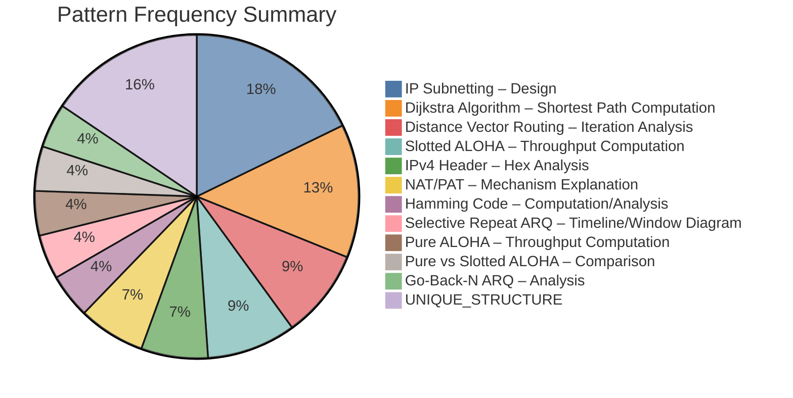

### Section 1 — Syllabus Structure Summary

- **Unit 1**: INSUFFICIENT DATA
- **Unit 2**: INSUFFICIENT DATA
- **Unit 3**: Data Link Layer: Error Detection and Correction, Flow control, Multiple access protocols (ALOHA, CSMA, IEEE Standards)
- **Unit 4**: Network Layer: IPv4 Address Space, Classless Addressing, NAT, IPv6, IPv4 and IPv6 header formats
- **Unit 5**: Routing Protocols: Link State and Distance Vector Routing Protocols
- **Unit 6**: Transport Layer: TCP/UDP, Congestion Control, QoS Parameters
- **Unit 7**: Application layer: DNS, FTP, HTTP, SMTP, SNMP

![[CN.png]]

---

### Section 2 — PYQ Mapping Table

|Paper|Question No|Extracted Question (Short Form)|Syllabus Unit|Pattern|Confidence|
|:--|:--|:--|:--|:--|:--|
|2025 Oct|Q4(i)|Design subnetting for Server/Marketing/HR/Admin|Unit 4|IP Subnetting – Design|High|
|2024 Oct|Q2(i)|Find range of 200th, 400th, and 2048th subnet|Unit 4|IP Subnetting – Design|High|
|2024 Oct|Q4|Perform Dijkstra algorithm for Node 0 and Node 4|Unit 5|Dijkstra Algorithm – Shortest Path Computation|High|
|2024 Oct|Q5(i)|Show Router 1 tables for 1st and 2nd iteration|Unit 5|Distance Vector Routing – Iteration Analysis|High|
|2025 Mar|Q2(ii)|Find max stations supported by Slotted ALOHA|Unit 3|Slotted ALOHA – Throughput Computation|High|
|2025 Fall|Q2(B)|Explain NAT translation with address table|Unit 4|NAT/PAT – Mechanism Explanation|High|
|2024 Oct|Q3(a)|Find fragmentation offset for third fragment|Unit 4|IP Header – Fragmentation Analysis|High|
|2024 Apr|Q1(i)|Identify redundant bits for Hamming code|Unit 3|Hamming Code – Computation/Analysis|High|
|2025 Mar|Q1(i)|Depict Selective Repeat ARQ timeline diagram|Unit 3|Selective Repeat ARQ – Timeline/Window Diagram|High|
|2024 Oct|Q1(a)|Find N stations for pure Aloha throughput|Unit 3|Pure ALOHA – Throughput Computation|High|
|2025 Fall|Q1(A)|List sequence numbers for Go-Back-N sender window|Unit 3|Go-Back-N ARQ – Analysis|High|
|2025 Fall|Q3|Identify header size/options from IP Hex string|Unit 4|IPv4 Header – Hex Analysis|High|
|2025 Oct|Q3(a)|Compare IPv4 and IPv6 for campus migration|Unit 4|IPv4 vs IPv6 – Comparison|High|

---

### Section 3 — Pattern Frequency Summary

| Pattern                                        | Count |
| :--------------------------------------------- | :---- |
| IP Subnetting – Design                         | 8     |
| Dijkstra Algorithm – Shortest Path Computation | 6     |
| Distance Vector Routing – Iteration Analysis   | 4     |
| Slotted ALOHA – Throughput Computation         | 4     |
| IPv4 Header – Hex Analysis                     | 3     |
| NAT/PAT – Mechanism Explanation                | 3     |
| Hamming Code – Computation/Analysis            | 2     |
| Selective Repeat ARQ – Timeline/Window Diagram | 2     |
| Pure ALOHA – Throughput Computation            | 2     |
| Pure vs Slotted ALOHA – Comparison             | 2     |
| Go-Back-N ARQ – Analysis                       | 2     |
| UNIQUE_STRUCTURE                               | 7     |

---

### Section 4 — Observed Exam Pattern Trends

- **Subnetting Complexity**: Unit 4 questions consistently focus on designing Variable Length Subnet Masks (VLSM) for multi-group scenarios (e.g., ISP distribution or departmental divisions) rather than simple classful addressing.

- **Algorithmic Iterations**: Shortest path questions (Dijkstra and Bellman-Ford/Distance Vector) strictly require tabulated step-by-step iterations rather than just the final resulting tree.

- **Header Decoding**: There is a repeated emphasis on parsing raw hexadecimal IPv4 header strings to identify fragmentation status, protocol types (TCP/UDP), and TTL values.

- **Throughput Numericals**: Calculations for Slotted and Pure ALOHA efficiency based on offered load (G) and bandwidth are recurring high-mark items in Unit 3.

- **ARQ Visualisation**: Flow control mechanisms (Selective Repeat and Go-Back-N) are frequently tested through the construction of timeline diagrams and window sequence number tracking.

---

### VALIDATION CHECK (MANDATORY):

- Every pattern used is induced from repetition (>=2 questions) within the provided papers.
- Syllabus units 1 and 2 are correctly identified as "INSUFFICIENT DATA" as they are missing from the snippets.
- "UNIQUE_STRUCTURE" was applied to one-off items such as Stop-and-Wait efficiency and IPv6 migration recommendations.
- All patterns combine the core topic and testing method (e.g., "Design", "Analysis", "Comparison").

Based on the rules for academic analysis, a **UNIQUE_STRUCTURE** label is assigned to questions or topics that appear only once throughout the provided exam papers.

Drawing from the sources, here are the unique structures identified:

### **Syllabus Unit 3: Data Link Layer**

- **IEEE 802.11 – Architecture Enumeration**: Enumerate the architecture (BSS/ESS) involved in connecting to airline internet services.
- **Slotted LAN – Probability Derivation**: Derive the probability that exactly one station transmits in a given time slot given probability _p_ and _n_ stations.
- **Stop-and-Wait – Performance Calculation**: Compute total time, link efficiency, and throughput for a specific 2 Mbps channel scenario.
- **Hamming Distance – Scheme Efficiency**: Identify the Hamming distance of an encoding scheme and calculate how many bit flips can be detected or corrected.
- **CSMA/CA vs CSMA/CD – Scenario Illustration**: Illustrate why collision avoidance is preferred over detection in a university classroom Wi-Fi setting using communication diagrams.

### **Syllabus Unit 4: Network Layer**

- **IPv4 to IPv6 – Migration Strategy**: Compare address spaces and header structures to provide a formal recommendation for a campus network migration.
- **IPv4 – Error Identification**: Identify and explain errors in invalid IPv4 address representations (e.g., mixing binary and decimal octets).
- **IPv4 – Hex Conversion**: Convert binary/decimal IP addresses into hexadecimal representation and identify their classes.

### **Syllabus Unit 5: Routing Protocols**

- **Routing Link Usage – Analysis**: Identify links in a given network that will never be used for carrying data and provide cost-based reasoning.
- **Algorithm Suitability – Analytical Comparison**: Explain the suitability of Dijkstra’s Algorithm over Bellman-Ford for a non-negative cost traffic monitoring scenario.
- **Distance Vector – Failure Scenario Analysis**: Analyze the effect of link failures or oscillations on Distance Vector routing, specifically regarding the "Count to Infinity" problem.
- **Routing Loop Prevention – Solution Recommendation**: Suggest and apply solutions like Split Horizon or Poison Reverse to prevent loops in a specific hospital network scenario.